Flights in Developed and Developing Countries
========================================================
author: Daniel and Jocelyn
date: 4/24/18
autosize: true

Research Questions
========================================================

- Can we predict the number of flights using average GDP growth?
- Is there a difference in the number of flights between developed and developing countries? Recently developed countries?
- Is there preferential travel to certain locations for developed and developing countires?

Basic Info
========================================================

- Flights are classified as developed if there Per Capita GDP was greater than $12,000
- There are 33,559 flights in our dataset
- 156 unique source and destination countries
- `developed.x` is 1 if the source country is developed, and 0 if developing

Number of Flights per Country
========================================================

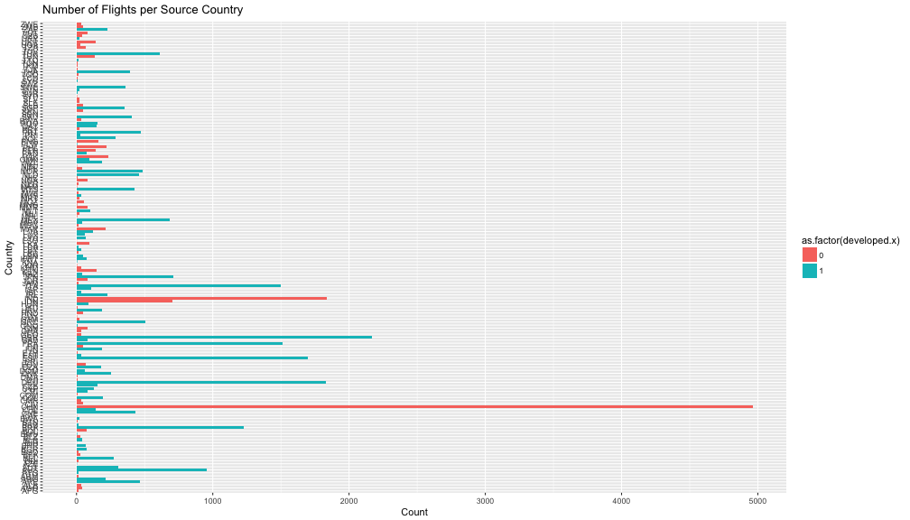


Distribution of Per Capita GDP
========================================================

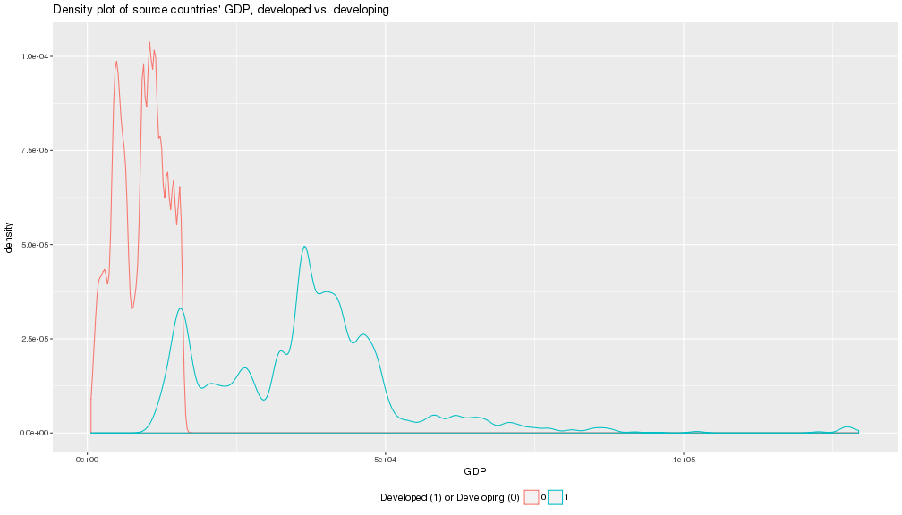

Distribution of Per Capita GDP Growth
========================================================

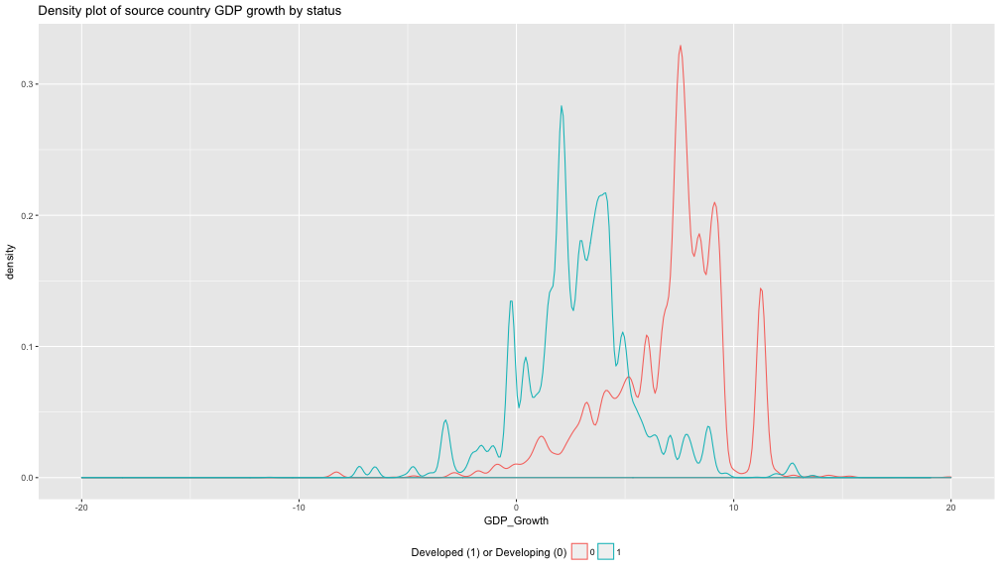

Number of Flights vs. Average GDP Growth
========================================================

- Explore the relationship between the Number of Flights and Average Per Capita GDP Growth via scatterplots and smoothing
- Transformation and Normalization
- Parametric and Non-Parametric Regression

Linear Fit and Loess Smoother
========================================================

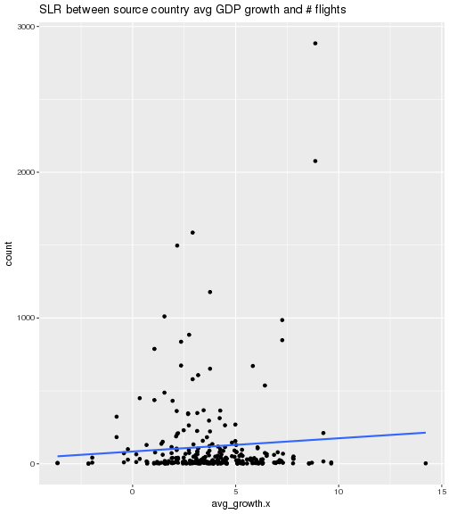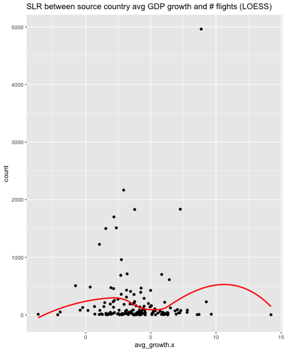

Normalization of Flights by Population
========================================================

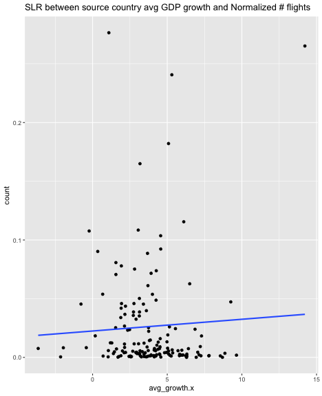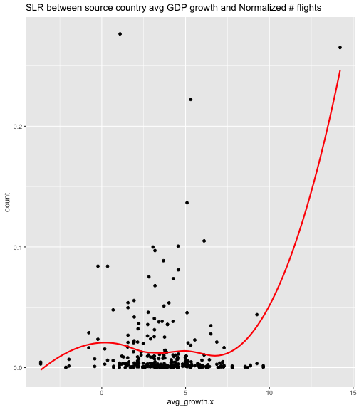

Log Transformation of Counts
========================================================

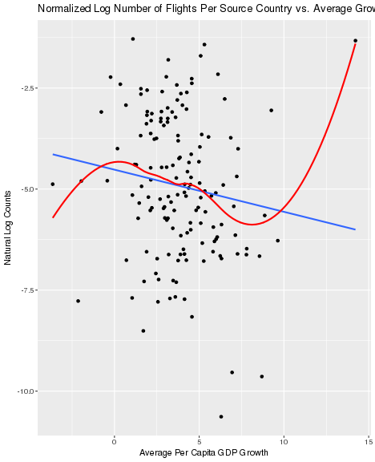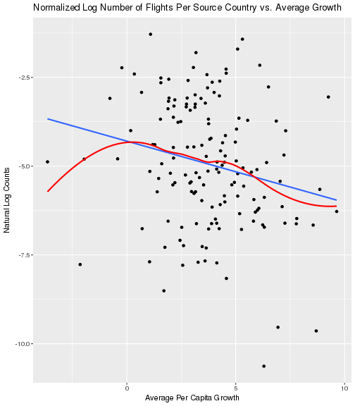

Parametric Regression: log_count ~ avg_growth.x
========================================================


```

Call:
lm(formula = log_count ~ avg_growth.x, data = normal_minus)

Residuals:
    Min      1Q  Median      3Q     Max 
-4.4549 -1.0849 -0.1135  1.1765  4.5242 

Coefficients:
             Estimate Std. Error t value Pr(>|t|)    
(Intercept)  -5.22043    0.21060 -24.788  < 2e-16 ***
avg_growth.x -0.15224    0.04834  -3.149  0.00181 ** 
---
Signif. codes:  0 '***' 0.001 '**' 0.01 '*' 0.05 '.' 0.1 ' ' 1

Residual standard error: 1.795 on 278 degrees of freedom
Multiple R-squared:  0.03445,	Adjusted R-squared:  0.03098 
F-statistic: 9.919 on 1 and 278 DF,  p-value: 0.001814
```

Parametric Conditions
========================================================

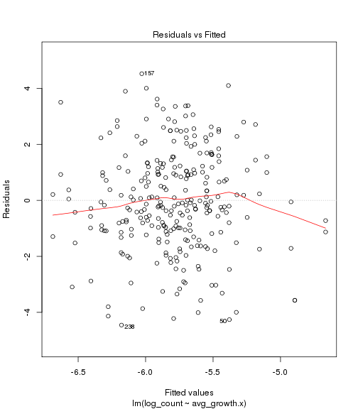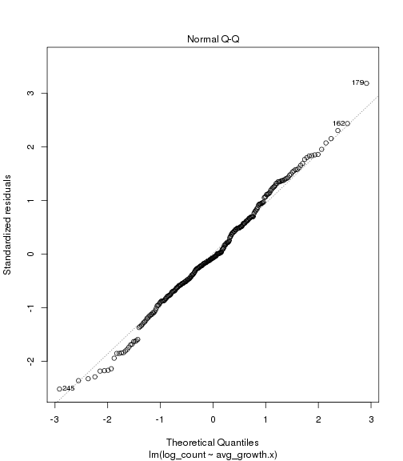

Non-Parametric Regression
========================================================


```
Call:
rfit.default(formula = log_count ~ avg_growth.x, data = normal)

Coefficients:
              Estimate Std. Error  t.value p.value    
(Intercept)  -5.340557   0.205313 -26.0118 < 2e-16 ***
avg_growth.x -0.143715   0.046648  -3.0808 0.00227 ** 
---
Signif. codes:  0 '***' 0.001 '**' 0.01 '*' 0.05 '.' 0.1 ' ' 1

Multiple R-squared (Robust): 0.02999173 
Reduction in Dispersion Test: 8.62641 p-value: 0.00359 
```

Regression Results and Comparison
========================================================

- Conditions met for both Parametric and Non-Parametric regression
- Both found that `avg_growth.x` was a significant predictor of `log_count` ($p-value = .00181 & .0005$)
- However, both models suggested that `avg_growth.x` explained very little variability in `log_count` ($R^{2} = .034 & .041$)
- Although `avg_growth.x` is a significant predictor, the model lacks any substantial predicting power.

Has Travel Increased in Recently Developed Countries?
========================================================

- Identified 7 countries that were developing in 2010, but were developed in 2016:
  - China
  - Mongolia
  - Bosnia and Herzegovina
  - Nauru
  - Peru
  - Sri Lanka
  - Turkmenistan
  
Parametric ANOVA
========================================================

Parametric Multiple Comparisons 
========================================================

Non-Parametric ANOVA
========================================================

Shift Model
========================================================

Non-Parametric Multiple Comparisons
========================================================

ANOVA Results and Conclusions
========================================================

Travel Locations
========================================================

Conclusion and Limitations
========================================================

- Average Per Capita GDP Growth is a significant predictor of the normalized natural log of the number of flights, but lacks any substantial predictive power
- Second Question Conclusion
- Third Question and Conclusion

THE END
========================================================

