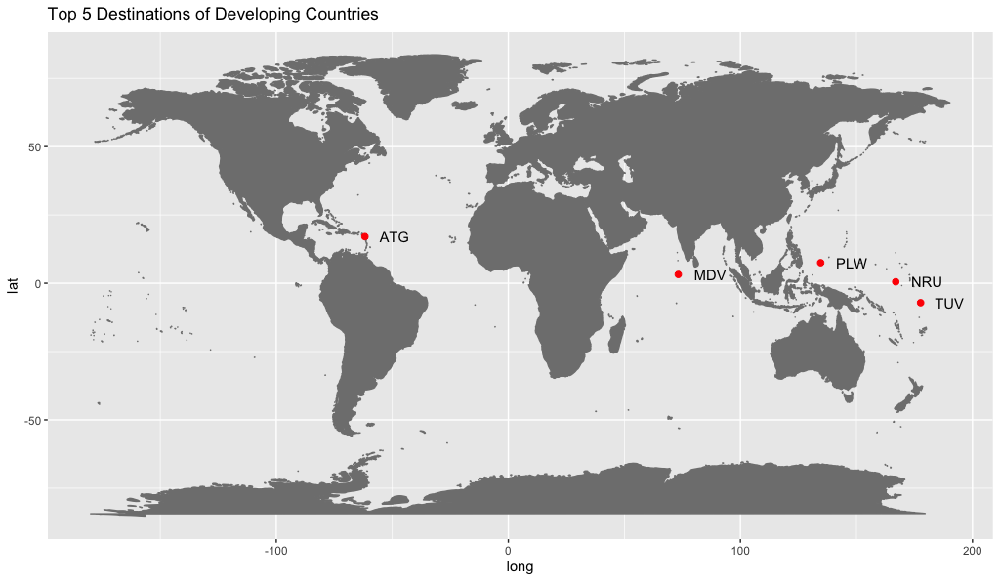

<style>
.reveal pre code {
  font-size: 1em;
}

.small-code p {
  font-size:  14px;
}

.section .reveal .state-background {
  background-image: url('http://ichef.bbci.co.uk/images/ic/1600xn/p03vfmdq.jpg')
}
.reveal .slides section .mediaInline img {
  margin-left:50px
}
.lists li {
  margin: 0;
  font-size: 20px;
  line-height: 30px
}

</style>


Flights in Developed and Developing Countries
========================================================
author: Daniel and Jocelyn
date: 4/24/18
autosize: true
transition: rotate
transition-speed: fast

Research Questions
========================================================
incremental: true
1. Can we predict the number of flights using average GDP growth?
2. Is there a difference in the number of flights between developed and developing countries? Recently developed countries?
3. Is there preferential travel to certain locations for developed and developing countires?

Data Summary
========================================================
incremental: true

- Flight data from the Flight Route Database (Kaggle)
- Per Capita GDP from the World Bank Website - focused on 2010-2016
- Flights are classified as developed if there Per Capita GDP was greater than $12,000
- There are 33,559 flights in our dataset
- 156 unique source and destination countries

Number of Flights per Country
========================================================


Distribution of Per Capita GDP
========================================================


Distribution of Per Capita GDP Growth
========================================================


1. Predicting flights using average GDP growth
========================================================
incremental:true

Goal: 
- Explore the relationship between the Number of Flights and Average Per Capita GDP Growth via plots and smoothing

Initial plots (count ~ GDP growth):
- SLR with linear fit: `geom_smooth='lm'`, and with LOESS fit: `geom_smooth='loess'`

Intermediate step:
- Normalization by source country population and log transformation of count

Then: Parametric and Non-Parametric Regression

Linear Fit and LOESS Smoother
========================================================


Normalization of Flights by Population
========================================================


Log Transformation of Counts
========================================================


Parametric Regression: log_count ~ avg_growth.x
========================================================
class: small-code


```

Call:
lm(formula = log_count ~ avg_growth.x, data = normal_minus)

Residuals:
    Min      1Q  Median      3Q     Max 
-5.2537 -0.9822  0.0758  1.4343  3.7856 

Coefficients:
             Estimate Std. Error t value Pr(>|t|)    
(Intercept)  -4.29517    0.28235 -15.212  < 2e-16 ***
avg_growth.x -0.17234    0.06482  -2.659  0.00871 ** 
---
Signif. codes:  0 '***' 0.001 '**' 0.01 '*' 0.05 '.' 0.1 ' ' 1

Residual standard error: 1.738 on 147 degrees of freedom
Multiple R-squared:  0.04588,	Adjusted R-squared:  0.03939 
F-statistic: 7.069 on 1 and 147 DF,  p-value: 0.008712
```

Parametric Conditions
========================================================
class: small-code


Non-Parametric Regression
========================================================


```
Call:
rfit.default(formula = log_count ~ avg_growth.x, data = normal_minus)

Coefficients:
              Estimate Std. Error  t.value   p.value    
(Intercept)  -4.193363   0.312363 -13.4246 < 2.2e-16 ***
avg_growth.x -0.178268   0.064666  -2.7567  0.006578 ** 
---
Signif. codes:  0 '***' 0.001 '**' 0.01 '*' 0.05 '.' 0.1 ' ' 1

Multiple R-squared (Robust): 0.04850027 
Reduction in Dispersion Test: 7.49295 p-value: 0.00696 
```

Regression Results and Comparison
========================================================

- Both found that `avg_growth.x` was a significant predictor of `log_count` ($p-value = 0.00871$ & $0.00658$)
- However, both models suggested that `avg_growth.x` explained very little variability in `log_count` ($R^{2} = 0.0458$ & $0.0485$)
- Although `avg_growth.x` is a significant predictor, the model lacks any substantial predicting power.

2. Investigating differences in travel patterns by development status
========================================================
incremental: true

Goal: 
- Creating a new category of `recently_developed`, we want to investigate whether our categorical variable (3 values) of development status explains flight count

Procedure:
- Parametric and non-parametric ANOVA
- If a significant difference is found, explore further with a multiple test comparison test such as Fisher's LSD


Recently Developed Countries
========================================================

- Identified 7 countries that were developing in 2010, but were developed in 2016:
  - China
  - Mongolia
  - Bosnia and Herzegovina
  - Nauru
  - Peru
  - Sri Lanka
  - Turkmenistan
  
Development Status
========================================================


Parametric ANOVA:
========================================================

Running parametric ANOVA,  we find that 


```
Analysis of Variance Table

Response: log_count
            Df Sum Sq Mean Sq F value    Pr(>F)    
dev_status   2 147.34  73.670  32.734 1.551e-12 ***
Residuals  151 339.84   2.251                      
---
Signif. codes:  0 '***' 0.001 '**' 0.01 '*' 0.05 '.' 0.1 ' ' 1
```

Parametric Conditions:
========================================================
class: small-code


Parametric Multiple Comparisons - Fisher's LSD:
========================================================


```

	Pairwise comparisons using t tests with pooled SD 

data:  log_count and dev_status 

                   Developed Developing
Developing         9.2e-13   -         
Recently Developed 0.01      0.61      

P value adjustment method: holm 
```

Non-Parametric ANOVA
========================================================


```

	Kruskal-Wallis rank sum test

data:  log_count by as.factor(dev_status)
Kruskal-Wallis chi-squared = 52.653, df = 2, p-value = 3.686e-12
```

Non-Parametric Conditions - Shift Model:
========================================================


Non-Parametric Multiple Comparisons - Wilcoxon Rank Sum
========================================================


```

	Pairwise comparisons using Wilcoxon rank sum test 

data:  log_count and dev_status 

                   Developed Developing
Developing         3.5e-12   -         
Recently Developed 0.0091    0.7627    

P value adjustment method: holm 
```

ANOVA Results and Conclusions
========================================================

- Both tests found that there was a least one significant difference in means and medians of flight between different development status (p-values $< 0.0001$).
- Fisher's LSD and Pairwise Wilcoxon Rank Sums found a significant differences between:
  - Developed and Developing (p-values $<0.0001$)
  - Developed and Recently Developed (p-value $= 0.01$ & p-value $= 0.0091$)
- Recently developed countries are more similar to developing than developed countries

3. Do developing countries fly to popular developed nation destinations?
========================================================
incremental:  true

Goal: 
- Investigate whether countries fly to different destinations, if so, is there any pattern?

Procedure:
- Find top 5 destinations of developed/developing nations, and then normalize by destination country's population, i.e. assume that higher population countries should receive more flights
- Exploratory plots, barcharts
- Run Two Proportion Z-test and Non-Parametric Binomial Test

Non-Normalized Travel Locations:
========================================================
class: lists

Most popular destinations for Developed:
  - Great Britain
  - Germany
  - Spain
  - Italy
  - France
  
Most popular destinations for Developing:
  - United Arab Emirate
  - Singapore
  - Japan
  - France
  - China

Normalized Top 5 Travel Destinations 
========================================================
class: lists

Most popular destinations for Developed:
<ul>
<li>Antigua and Barbuda</li>
<li>Iceland</li>
<li>St. Kitts and Nevis</li>
<li>Bermuda</li>
<li>Austria</li>
</ul>
  
Most popular destinations for Developing:
- Antigua and Barbuda 
- Nauru
- Tuvalu
- Palau
- Maldives

Travel Locations - Developed
========================================================


Travel Locations - Developing
========================================================



Prop of Flights to Top5 Developed Destinations
========================================================


Parametric - 2-Proportion Z-test (2/5 shown)
========================================================
class: small-code


```

	2-sample test for equality of proportions with continuity
	correction

data:  c(p_UK, p_UK2) out of c(total_developed, total_developing)
X-squared = 635.27, df = 1, p-value < 2.2e-16
alternative hypothesis: two.sided
95 percent confidence interval:
 0.06197319 0.06967335
sample estimates:
     prop 1      prop 2 
0.073708240 0.007884972 
```

```

	2-sample test for equality of proportions with continuity
	correction

data:  c(p_FR, p_FR2) out of c(total_developed, total_developing)
X-squared = 152.61, df = 1, p-value < 2.2e-16
alternative hypothesis: two.sided
95 percent confidence interval:
 0.02181991 0.02871662
sample estimates:
    prop 1     prop 2 
0.03955398 0.01428571 
```

```
[1] 3.561030e-140 2.942982e-117 1.628861e-106  1.344739e-75  4.670557e-35
```

Parametric Conditions
========================================================

- Sample is random
- Trials are independent
- Includes at least 10 successes and 10 failures
- Binary outcomes: success or failure

Non-Parametric - Binomial Test
========================================================
class: small-code


Testing $H_0:p=p_0$, $H_A:p \neq p_0$ where $p_0$ is the developed proportion of flights to top5 developed destinations: 0.0737, 0.067, 0.0587, 0.0455, 0.0396 and `n` is the total number of developing flights: 10780

For the test shown below we find a p-value of 4.319 &times; 10<sup>-238</sup> and for all 5 tests we find p-values respectively of 4.319 &times; 10<sup>-238</sup>, 2.765 &times; 10<sup>-195</sup>, 4.703 &times; 10<sup>-179</sup>, 1.088 &times; 10<sup>-124</sup>, 2.021 &times; 10<sup>-53</sup>


```


data:  c(successes[1], failures[1])
number of successes = 80, number of trials = 10000, p-value <2e-16
alternative hypothesis: true probability of success is not equal to 0.0737
95 percent confidence interval:
 0.00630 0.00974
sample estimates:
probability of success 
               0.00788 
```


Non-Parametric Conditions
========================================================

- Trials are independent
- Binary outcomes: success or failure
- Probability of success, *p*, remains constant

Comparison
========================================================


```
Error in add_emoji(emoji = "2708") : could not find function "add_emoji"
```
