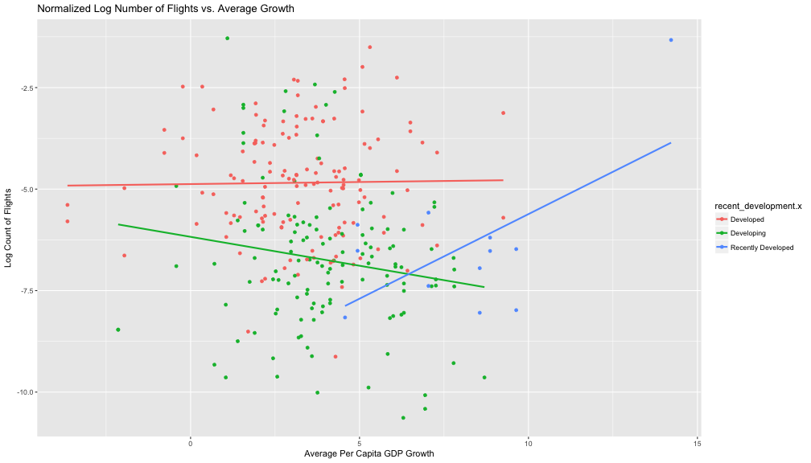
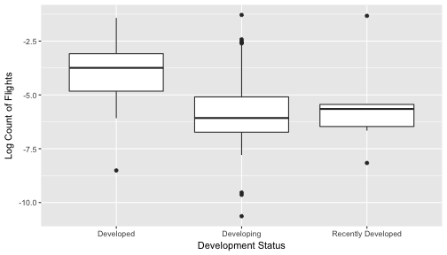
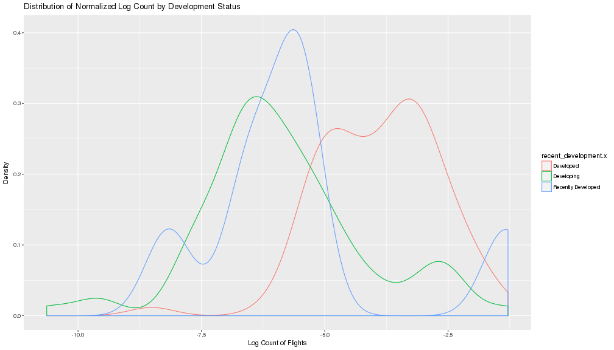
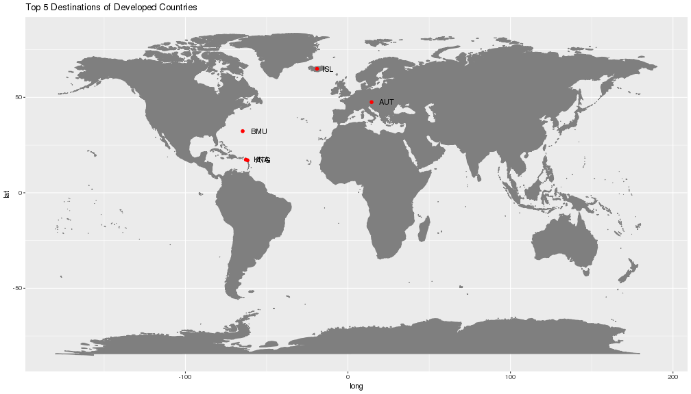
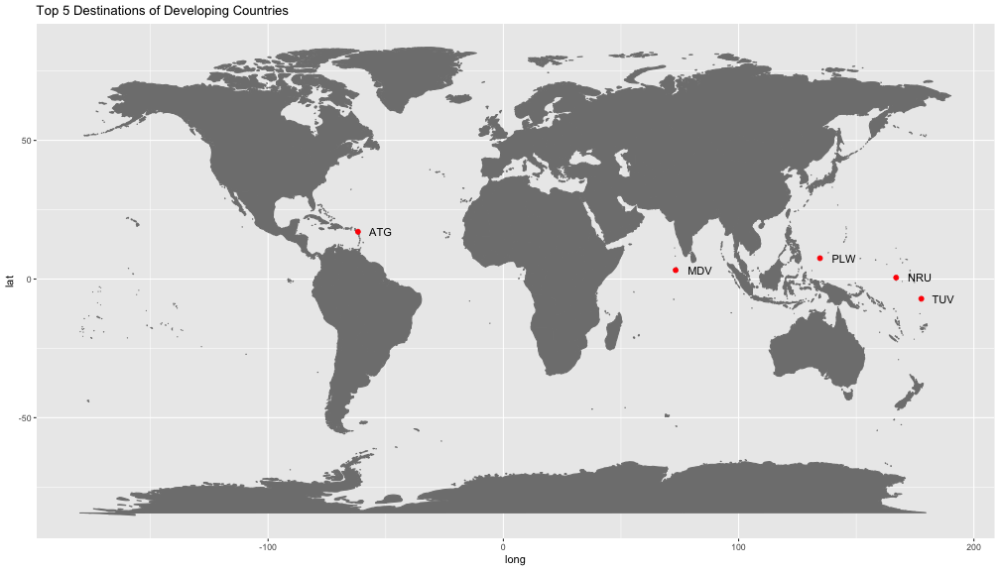
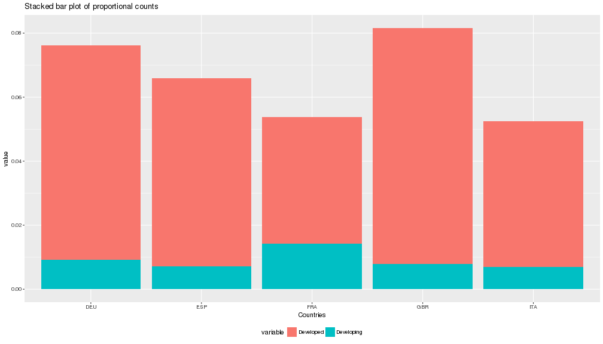
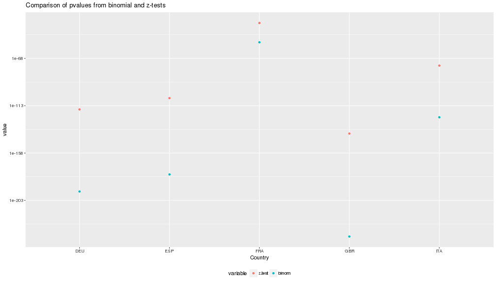

<style>
.reveal pre code {
  font-size: 1em;
}
.section .reveal .state-background {
  background-image: url('http://ichef.bbci.co.uk/images/ic/1600xn/p03vfmdq.jpg')
}
</style>


Flights in Developed and Developing Countries
========================================================
class: first
author: Daniel and Jocelyn
date: 4/24/18
autosize: true
transition: rotate
transition-speed: fast

Research Questions
========================================================
incremental: true
1. Can we predict the number of flights using average GDP growth?
2. Is there a difference in the number of flights between developed and developing countries? Recently developed countries?
3. Is there preferential travel to certain locations for developed and developing countires?

Data Summary
========================================================
incremental: true

- Flight data from the Flight Route Database (Kaggle)
- Per Capita GDP from the World Bank Website - focused on 2010-2016
- Flights are classified as developed if there Per Capita GDP was greater than $12,000
- There are 33,559 flights in our dataset
- 156 unique source and destination countries
- `developed.x` is 1 if the source country is developed, and 0 if developing

1. Predicting flights using average GDP growth
========================================================

Number of Flights per Country
========================================================


Distribution of Per Capita GDP
========================================================


Distribution of Per Capita GDP Growth
========================================================


Number of Flights vs. Average GDP Growth
========================================================

- Explore the relationship between the Number of Flights and Average Per Capita GDP Growth via scatterplots and smoothing
- Transformation and Normalization
- Parametric and Non-Parametric Regression

Linear Fit and Loess Smoother
========================================================


Normalization of Flights by Population
========================================================


Log Transformation of Counts
========================================================


Parametric Regression: log_count ~ avg_growth.x
========================================================
class: small-code


```

Call:
lm(formula = log_count ~ avg_growth.x, data = normal_minus)

Residuals:
    Min      1Q  Median      3Q     Max 
-5.2537 -0.9822  0.0758  1.4343  3.7856 

Coefficients:
             Estimate Std. Error t value Pr(>|t|)    
(Intercept)  -4.29517    0.28235 -15.212  < 2e-16 ***
avg_growth.x -0.17234    0.06482  -2.659  0.00871 ** 
---
Signif. codes:  0 '***' 0.001 '**' 0.01 '*' 0.05 '.' 0.1 ' ' 1

Residual standard error: 1.738 on 147 degrees of freedom
Multiple R-squared:  0.04588,	Adjusted R-squared:  0.03939 
F-statistic: 7.069 on 1 and 147 DF,  p-value: 0.008712
```

Parametric Conditions
========================================================
class: small-code


Non-Parametric Regression
========================================================


```
Call:
rfit.default(formula = log_count ~ avg_growth.x, data = normal_minus)

Coefficients:
              Estimate Std. Error  t.value   p.value    
(Intercept)  -4.193363   0.312363 -13.4246 < 2.2e-16 ***
avg_growth.x -0.178268   0.064666  -2.7567  0.006578 ** 
---
Signif. codes:  0 '***' 0.001 '**' 0.01 '*' 0.05 '.' 0.1 ' ' 1

Multiple R-squared (Robust): 0.04850027 
Reduction in Dispersion Test: 7.49295 p-value: 0.00696 
```

Regression Results and Comparison
========================================================

- Both found that `avg_growth.x` was a significant predictor of `log_count` ($p-value = .00871 & .00658$)
- However, both models suggested that `avg_growth.x` explained very little variability in `log_count` ($R^{2} = .0458 & .0485$)
- Although `avg_growth.x` is a significant predictor, the model lacks any substantial predicting power.

2. Investigating differences in travel patterns by development status
========================================================

Has Travel Increased in Recently Developed Countries?
========================================================

- Identified 7 countries that were developing in 2010, but were developed in 2016:
  - China
  - Mongolia
  - Bosnia and Herzegovina
  - Nauru
  - Peru
  - Sri Lanka
  - Turkmenistan
  
Development Status
========================================================



Parametric ANOVA:
========================================================


```
Analysis of Variance Table

Response: log_count
                      Df Sum Sq Mean Sq F value    Pr(>F)    
recent_development.x   2 147.34  73.670  32.734 1.551e-12 ***
Residuals            151 339.84   2.251                      
---
Signif. codes:  0 '***' 0.001 '**' 0.01 '*' 0.05 '.' 0.1 ' ' 1
```

Parametric Conditions:
========================================================
class: small-code



Parametric Multiple Comparisons - Fisher's LSD:
========================================================


```

	Pairwise comparisons using t tests with pooled SD 

data:  log_count and recent_development.x 

                   Developed Developing
Developing         9.2e-13   -         
Recently Developed 0.01      0.61      

P value adjustment method: holm 
```

Non-Parametric ANOVA
========================================================


```

	Kruskal-Wallis rank sum test

data:  log_count by as.factor(recent_development.x)
Kruskal-Wallis chi-squared = 52.653, df = 2, p-value = 3.686e-12
```

Non-Parametric Conditions - Shift Model:
========================================================



Non-Parametric Multiple Comparisons - Wilcoxon Rank Sum
========================================================


```

	Pairwise comparisons using Wilcoxon rank sum test 

data:  log_count and recent_development.x 

                   Developed Developing
Developing         3.5e-12   -         
Recently Developed 0.0091    0.7627    

P value adjustment method: holm 
```

ANOVA Results and Conclusions
========================================================

- Both tests found that there was a least one significant difference in means and medians of flight between different development status (p-values $< 0.0001$).
- Fisher's LSD and Pairwise Wilcoxon Rank Sums found a significant differences between:
  - Developed and Developing (p-values $<0.0001$)
  - Developed and Recently Developed (p-value $= 0.01$ & p-value = $= 0.0091$)
- Recently developed countries are more similar to developing than developed countries

3. Do developing countries fly to popular developed nation destinations?
========================================================

Normalized Travel Locations 
========================================================

- Most popular destinations for Developed:
  - Antigua and Barbuda
  - Iceland
  - St. Kitts and Nevis
  - Bermuda
  - Austria
- Most popular destinations for Developing:
  - Antigua and Barbuda
  - Nauru
  - Tuvalu
  - Palau
  - Maldives
  
Travel Locations - Developed
========================================================



Travel Locations - Developing
========================================================




Non-Normalized Travel Locations:
========================================================

- Most popular destinations for Developed:
  - Great Britain
  - Germany
  - Spain
  - Italy
  - France
- Most popular destinations for Developing:
  - United Arab Emirate
  - Singapore
  - Japan
  - France
  - China

Parametric - Two Proportion Z-test
========================================================




Parametric - Two Proportion Z-test
========================================================
class: small-code


```

	2-sample test for equality of proportions with continuity
	correction

data:  c(p_UK, p_UK2) out of c(total_developed, total_developing)
X-squared = 635.27, df = 1, p-value < 2.2e-16
alternative hypothesis: two.sided
95 percent confidence interval:
 0.06197319 0.06967335
sample estimates:
     prop 1      prop 2 
0.073708240 0.007884972 
```

```

	2-sample test for equality of proportions with continuity
	correction

data:  c(p_FR, p_FR2) out of c(total_developed, total_developing)
X-squared = 152.61, df = 1, p-value < 2.2e-16
alternative hypothesis: two.sided
95 percent confidence interval:
 0.02181991 0.02871662
sample estimates:
    prop 1     prop 2 
0.03955398 0.01428571 
```

```
[1] 3.561030e-140 2.942982e-117 1.628861e-106  1.344739e-75  4.670557e-35
```

Parametric Conditions
========================================================

- Sample is random
- Trials are independent
- Includes at least 10 successes and 10 failures
- Binary outcomes: success or failure

Non-Parametric - Binomial Test
========================================================
class: small-code


```
[1] 0.07370824 0.06703543 0.05869441 0.04552439 0.03955398
```

```
[1] 10780
```

```


data:  c(successes[1], failures[1])
number of successes = 85, number of trials = 10780, p-value <
2.2e-16
alternative hypothesis: true probability of success is not equal to 0.07370824
95 percent confidence interval:
 0.006302952 0.009740787
sample estimates:
probability of success 
           0.007884972 
```

```
[1] 4.319111e-238
```

```
[1] 4.319111e-238 2.764883e-195 4.703252e-179 1.088369e-124  2.021025e-53
```

Non-Parametric Conditions
========================================================

- Trials are independent
- Binary outcomes: success or failure
- Probability of success, *p*, remains constant

Comparison
========================================================




Proportion Conclusions
========================================================

- The Normalized Travel Locations suggest differences in travel patterns between N. America and Europe, N. America and Asia
- The proportion of flights to the Top 5 Non-Normalized destinations for developed countries are all significantly different from the proportion of flights for developing countries

Conclusion
========================================================

- Average Per Capita GDP Growth is a significant predictor of the normalized natural log of the number of flights, but lacks any substantial predictive power.
- Recently developed countries are significantly different from developed countries, but similar to developing countries in terms of plane travel.
- There appears to be differences in travel patterns between developed and developing nations

Limitations
========================================================

- Since there is no Year variable for the flights, we were only able to compare total flights to average Per Capita GDP growth
- Unable to compare the median flights of recently developed countries to developing and developed countries in 2010 vs. 2016
- Year as a possible confounding variable

THE END
========================================================

